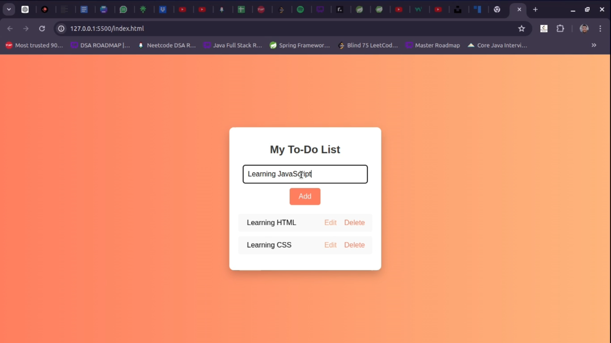

# To-Do List Application

A simple and interactive To-Do List application built with HTML, CSS, and JavaScript. This project demonstrates basic DOM manipulation, event handling, and CSS styling techniques.

## Table of Contents

- [Features](#features)
- [Demo](#demo)
- [Technologies Used](#technologies-used)
- [Setup](#setup)
- [Usage](#usage)
- [Code Structure](#code-structure)
- [Contributing](#contributing)
- [License](#license)

## Features

- Add new tasks to the list.
- Mark tasks as completed.
- Edit existing tasks.
- Delete tasks from the list.
- Responsive and modern UI design.

## Demo

Check out the live demo: [Live Demo] https://github.com/premlalwani09/Todo-List



## Technologies Used

- HTML
- CSS
- JavaScript

## Setup

To run this project locally, follow these steps:

1. **Clone the repository:**
    ```bash
    git clone https://github.com/premlalwani09/Todo-List
    ```

2. **Navigate to the project directory:**
    ```bash
    cd todo-list
    ```

3. **Open `index.html` in your web browser:**
    ```bash
    open index.html
    ```

## Usage

1. **Add a Task:**
   - Type your task in the input field.
   - Click the "Add" button or press Enter to add the task to the list.

2. **Mark a Task as Completed:**
   - Click on a task to mark it as completed. The task will be highlighted and struck through.

3. **Edit a Task:**
   - Click the "Edit" button next to a task to edit the task description.
   - Enter the new description and press Enter or click outside the input field to save changes.

4. **Delete a Task:**
   - Click the "Delete" button next to a task to remove it from the list.